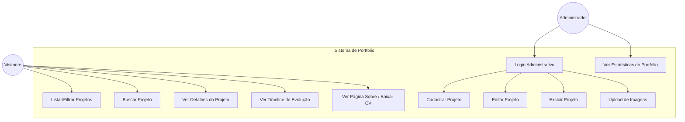
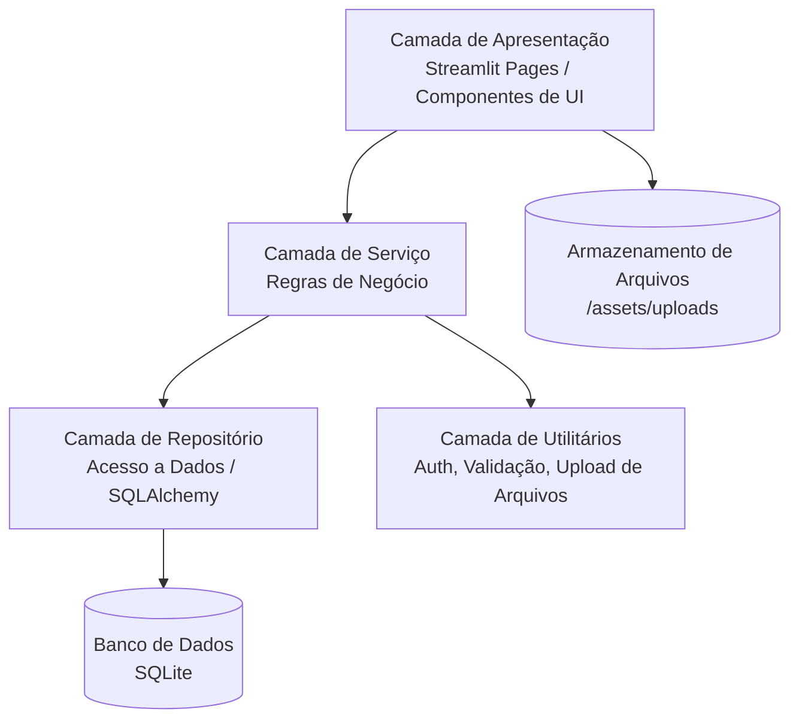
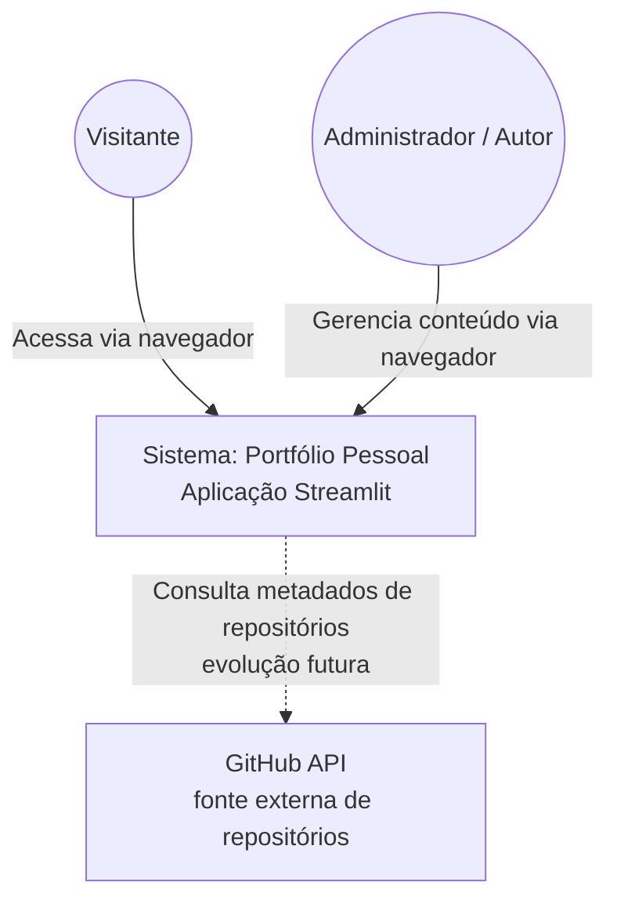
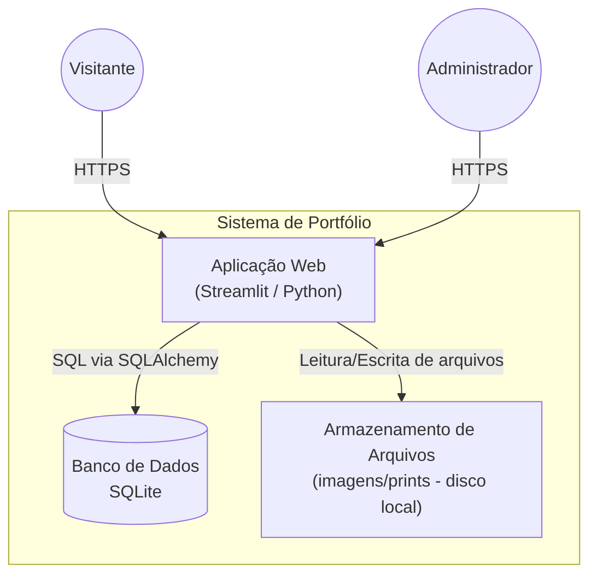
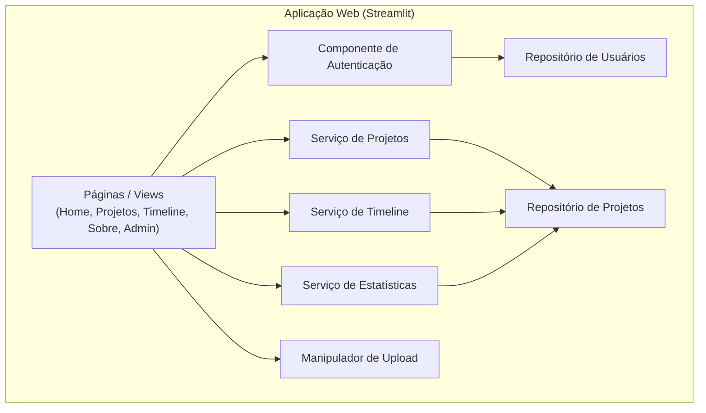
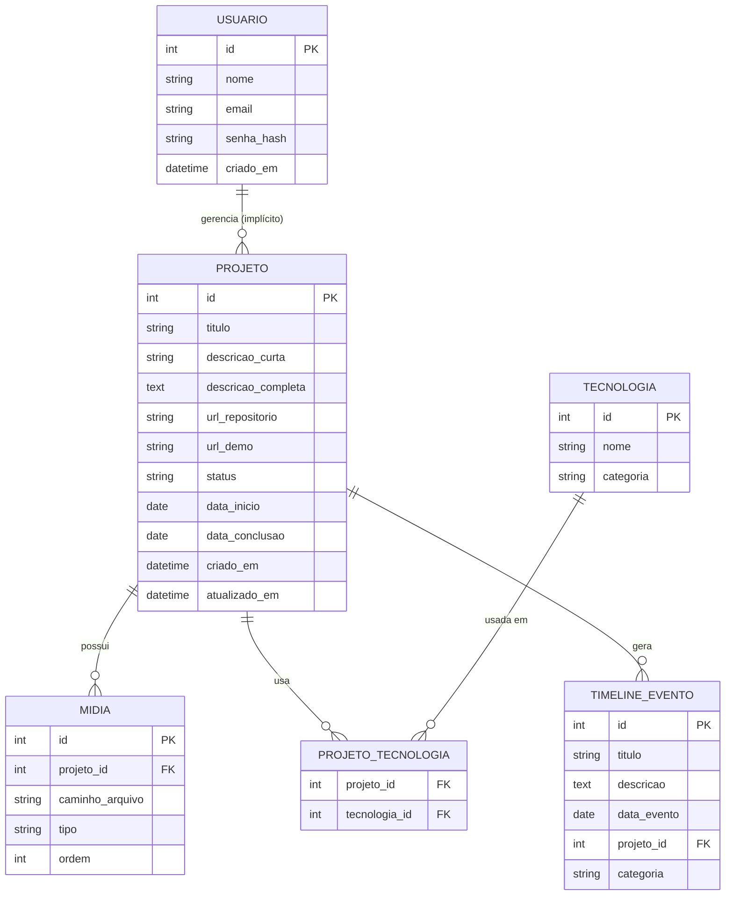
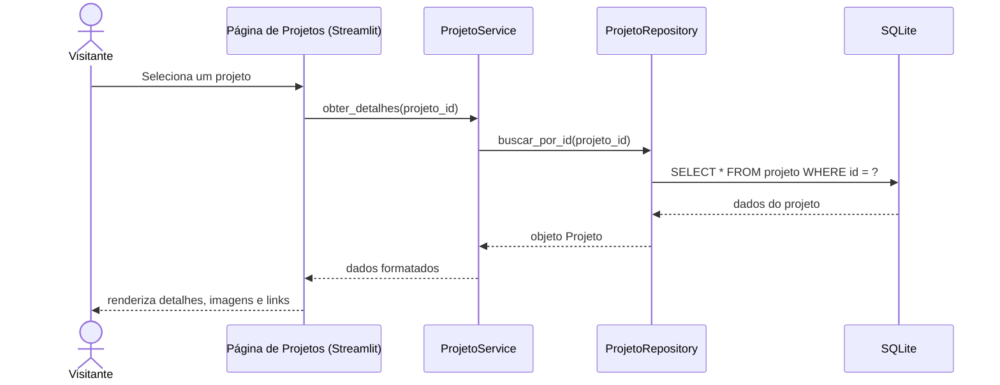
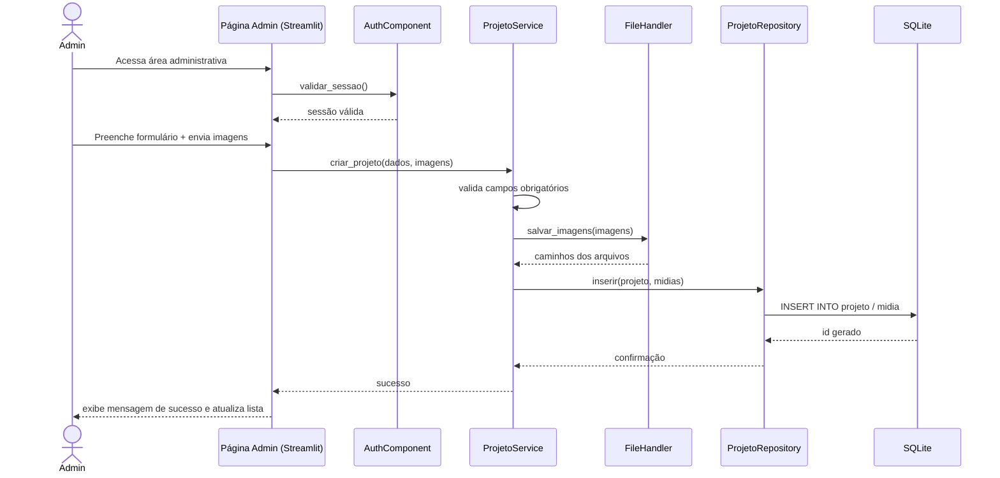
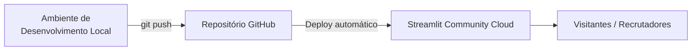

# Documento de Arquitetura de Software
## Portfólio Pessoal Interativo (Streamlit)

**Versão:** 1.0
**Autor:** [Seu Nome]
**Stack principal:** Python 3.11+, Streamlit, SQLite (SQLAlchemy)

---

## 1. Introdução

### 1.1 Propósito
Este documento descreve a arquitetura de software do sistema **Portfólio Pessoal**, uma aplicação web construída em Streamlit cujo objetivo é agrupar, apresentar e demonstrar os projetos desenvolvidos pelo autor, além de exibir sua evolução técnica ao longo do tempo (timeline de crescimento).

### 1.2 Escopo
O sistema permitirá:
- Exibição pública de projetos, com filtros e busca;
- Demonstrações (screenshots, links, embeds) de cada projeto;
- Linha do tempo de evolução profissional/técnica;
- Área administrativa autenticada para gerenciar o conteúdo (CRUD).

### 1.3 Público-alvo do documento
Recrutadores técnicos, revisores de portfólio e o próprio autor, como referência de projeto para estudo e manutenção futura.

---

## 2. Visão Geral do Sistema

O sistema é uma aplicação **monolítica modular**, com interface renderizada via Streamlit, lógica de negócio isolada em camada de serviços, persistência em SQLite via ORM (SQLAlchemy) e armazenamento de arquivos estáticos (imagens/prints) em disco local (ou bucket externo, se evoluir).

A ideia central é que o portfólio não seja uma lista estática, mas uma aplicação **viva**: o próprio site é um dos projetos demonstrados, prova de competência em arquitetura, Python e dados.

---

## 3. Atores do Sistema

| Ator | Descrição |
|---|---|
| **Visitante** | Qualquer pessoa que acessa o portfólio publicamente. Não autenticado. |
| **Administrador** | O autor do portfólio. Autenticado, com permissão de gerenciar conteúdo. |
| **(Futuro) GitHub API** | Ator externo/sistema, para sincronizar automaticamente repositórios (evolução futura). |

---

## 4. Requisitos Funcionais (RF)

| Código | Requisito |
|---|---|
| RF01 | O sistema deve listar todos os projetos cadastrados na página inicial/galeria. |
| RF02 | O sistema deve permitir filtrar projetos por categoria, tecnologia e status (concluído/em andamento). |
| RF03 | O sistema deve permitir buscar projetos por palavra-chave (nome/descrição). |
| RF04 | O sistema deve exibir uma página de detalhes por projeto, com descrição, tecnologias, imagens, link do repositório e link de demo (se houver). |
| RF05 | O sistema deve exibir uma timeline cronológica mostrando a evolução dos projetos e marcos de aprendizado do autor. |
| RF06 | O sistema deve exibir uma página "Sobre mim" com bio, habilidades (skills) e formas de contato. |
| RF07 | O sistema deve permitir que o Administrador se autentique via login e senha. |
| RF08 | O sistema deve permitir que o Administrador crie, edite e exclua projetos (CRUD completo). |
| RF09 | O sistema deve permitir upload de imagens/screenshots vinculadas a um projeto. |
| RF10 | O sistema deve permitir associar múltiplas tecnologias/tags a um projeto. |
| RF11 | O sistema deve exibir estatísticas agregadas (ex: total de projetos, linguagens mais usadas, projetos por ano). |
| RF12 | O sistema deve permitir o download do currículo (PDF) a partir da página "Sobre mim". |
| RF13 | O sistema deve validar os dados de entrada nos formulários administrativos (campos obrigatórios, formatos). |
| RF14 | O sistema deve permitir que o Administrador relacione um projeto a outro, indicando o **tipo de relação** (ex: reaproveitamento de código, evolução de ideia, mesma stack, case de estudo) e uma **descrição livre** do que foi reaproveitado/relacionado. |
| RF15 | O sistema deve exibir, na página de detalhes de um projeto, a lista de **projetos relacionados**, com link direto para cada um. |
| RF16 (futuro) | O sistema deve sincronizar automaticamente metadados de repositórios via GitHub API. |

---

## 5. Requisitos Não Funcionais (RNF)

| Código | Categoria | Requisito |
|---|---|---|
| RNF01 | Desempenho | O carregamento inicial de qualquer página deve ocorrer em até 3 segundos em conexão padrão. |
| RNF02 | Usabilidade | A interface deve ser responsiva e utilizável em desktop e mobile (layout `wide` do Streamlit + colunas adaptativas). |
| RNF03 | Segurança | Senhas administrativas devem ser armazenadas com hash (bcrypt/argon2), nunca em texto plano. |
| RNF04 | Segurança | Todo acesso ao banco deve ocorrer via ORM/queries parametrizadas, prevenindo SQL Injection. |
| RNF05 | Manutenibilidade | O código deve seguir separação em camadas (apresentação, serviço, repositório), com cobertura de testes unitários mínima de 60% na camada de serviço. |
| RNF06 | Portabilidade | O sistema deve rodar em qualquer SO compatível com Python 3.11+, sem dependências de sistema além das declaradas em `requirements.txt`. |
| RNF07 | Disponibilidade | A aplicação deve estar hospedada com disponibilidade-alvo de 99% (deploy em Streamlit Community Cloud ou similar). |
| RNF08 | Escalabilidade | A camada de acesso a dados deve ser desacoplada o suficiente para permitir migração de SQLite para PostgreSQL sem reescrever a camada de serviço. |
| RNF09 | Confiabilidade | O arquivo do banco SQLite deve ter rotina de backup (cópia versionada) antes de alterações estruturais. |
| RNF10 | Observabilidade | Erros da aplicação devem ser logados (arquivo de log ou serviço externo), sem expor stack trace ao visitante. |
| RNF11 | Compatibilidade | O sistema deve funcionar nas versões atuais de Chrome, Firefox e Edge. |

---

## 6. Diagrama de Casos de Uso



---

## 7. Arquitetura em Camadas

O sistema segue uma **arquitetura em camadas (layered architecture)**, adaptada às particularidades do Streamlit (que mistura apresentação e execução de script a cada interação):



**Responsabilidades:**
- **Apresentação:** páginas Streamlit (`pages/`), responsáveis apenas por capturar entrada do usuário e exibir dados — sem lógica de negócio direta.
- **Serviço:** regras como "não permitir excluir projeto sem confirmação", cálculo de estatísticas, orquestração entre repositórios.
- **Repositório:** funções de acesso ao banco (CRUD puro), isolando SQL/ORM do resto do sistema.
- **Utilitários:** autenticação, hashing de senha, validação de formulários, manipulação de upload de imagens.

Essa separação é o que permite, futuramente, trocar o SQLite por PostgreSQL, ou até trocar o Streamlit por outro front-end, sem reescrever as regras de negócio.

---

## 8. Diagramas C4

### 8.1 Nível 1 — Contexto (C1)



### 8.2 Nível 2 — Contêineres (C2)



### 8.3 Nível 3 — Componentes (C3, dentro da Aplicação Web)



---

## 9. Modelo de Dados (Diagrama ER)



**Observações:**
- `PROJETO_TECNOLOGIA` resolve o relacionamento N:N entre projetos e tecnologias.
- `TIMELINE_EVENTO` pode existir independente de projeto (marcos de carreira, certificações), por isso `projeto_id` é opcional (FK nullable).
- Como o volume de dados é pequeno (portfólio pessoal), SQLite é suficiente; o modelo já está normalizado (3FN) para facilitar migração futura, se necessário.

---

## 10. Diagramas de Sequência (fluxos principais)

### 10.1 Visitante consulta detalhes de um projeto



### 10.2 Administrador cadastra um novo projeto



---

## 11. Estrutura de Pastas do Projeto

```
portfolio/
├── app.py                          # Ponto de entrada (Home)
├── pages/
│   ├── 1_Projetos.py               # Listagem/filtro de projetos
│   ├── 2_Detalhes_Projeto.py       # Detalhe individual
│   ├── 3_Timeline.py               # Linha do tempo de evolução
│   ├── 4_Sobre.py                  # Bio, skills, contato, CV
│   └── 5_Admin.py                  # Área administrativa (CRUD)
│
├── src/
│   ├── config.py                   # Configurações gerais (paths, constantes)
│   │
│   ├── database/
│   │   ├── connection.py           # Engine/Session do SQLAlchemy
│   │   ├── models.py               # Modelos ORM (Projeto, Tecnologia, etc.)
│   │   └── seed.py                 # Dados iniciais / migração
│   │
│   ├── repositories/
│   │   ├── projeto_repository.py
│   │   ├── tecnologia_repository.py
│   │   ├── timeline_repository.py
│   │   └── usuario_repository.py
│   │
│   ├── services/
│   │   ├── projeto_service.py
│   │   ├── timeline_service.py
│   │   ├── stats_service.py
│   │   └── auth_service.py
│   │
│   ├── components/                 # Componentes de UI reutilizáveis
│   │   ├── card_projeto.py
│   │   ├── filtro_sidebar.py
│   │   └── timeline_view.py
│   │
│   └── utils/
│       ├── validators.py
│       ├── file_handler.py
│       └── security.py             # hashing, sessão
│
├── assets/
│   └── uploads/                    # Imagens dos projetos
│
├── data/
│   └── portfolio.db                # Banco SQLite
│
├── tests/
│   ├── test_projeto_service.py
│   ├── test_auth_service.py
│   └── test_repositories.py
│
├── .streamlit/
│   └── config.toml                 # Tema, layout
│
├── requirements.txt
├── .env.example
├── .gitignore
└── README.md
```

---

## 12. Stack Tecnológica e Decisões de Arquitetura (ADRs resumidos)

| Decisão | Escolha | Justificativa |
|---|---|---|
| Framework de UI | Streamlit | Prototipagem rápida em Python puro, ideal para portfólio técnico, sem exigir front-end separado (HTML/JS). |
| Banco de dados | SQLite | Volume de dados baixo, zero configuração de servidor, arquivo único versionável/portável — adequado para o estágio atual do projeto. |
| ORM | SQLAlchemy | Abstrai o SQL, facilita testes e permite migração futura para PostgreSQL/MySQL trocando apenas a *connection string*. |
| Padrão de acesso a dados | Repository Pattern | Isola a lógica de banco da lógica de negócio, melhora testabilidade e manutenibilidade. |
| Autenticação | Hash de senha (bcrypt) + estado de sessão do Streamlit | Simplicidade adequada a uma aplicação de usuário único (o administrador), sem necessidade de OAuth completo nesta fase. |
| Armazenamento de mídia | Sistema de arquivos local (`assets/uploads`) | Suficiente para o volume atual; abstraído via `FileHandler` para permitir troca por S3/Cloud Storage no futuro. |
| Testes | pytest | Padrão de mercado em Python, integração simples com camada de serviço. |

---

## 13. Estratégia de Deploy



- **Ambiente:** Streamlit Community Cloud (gratuito, integração direta com GitHub).
- **Banco:** SQLite versionado no repositório (ou volume persistente, dependendo do provedor) — ponto de atenção para RNF09 (backup).
- **Variáveis sensíveis:** senha do admin e chaves via `st.secrets` (nunca em código versionado).

---

## 14. Roadmap de Evolução da Arquitetura

1. **V1 (atual):** monolito Streamlit + SQLite + repository pattern.
2. **V2:** integração com GitHub API para sincronizar projetos automaticamente (RF14).
3. **V3:** migração opcional de SQLite para PostgreSQL (Supabase/Neon) se o projeto ganhar tráfego/dados relevantes.
4. **V4:** separar API (FastAPI) da camada de apresentação, permitindo múltiplos front-ends (Streamlit + site estático), demonstrando evolução para arquitetura desacoplada.

---

## 15. Rastreabilidade (Requisitos x Componentes)

| Requisito | Componente responsável |
|---|---|
| RF01–RF04, RF10 | `pages/1_Projetos.py`, `ProjetoService`, `ProjetoRepository` |
| RF05 | `pages/3_Timeline.py`, `TimelineService`, `TimelineRepository` |
| RF06, RF12 | `pages/4_Sobre.py` |
| RF07 | `AuthComponent`, `AuthService`, `UsuarioRepository` |
| RF08, RF13 | `pages/5_Admin.py`, `ProjetoService` |
| RF09 | `FileHandler` |
| RF11 | `StatsService` |
| RNF03, RNF04 | `security.py`, uso de SQLAlchemy parametrizado |
| RNF08 | Repository Pattern + `connection.py` |

---

*Documento vivo — deve ser atualizado conforme o projeto evolui, servindo também como evidência do processo de design de software no portfólio.*
